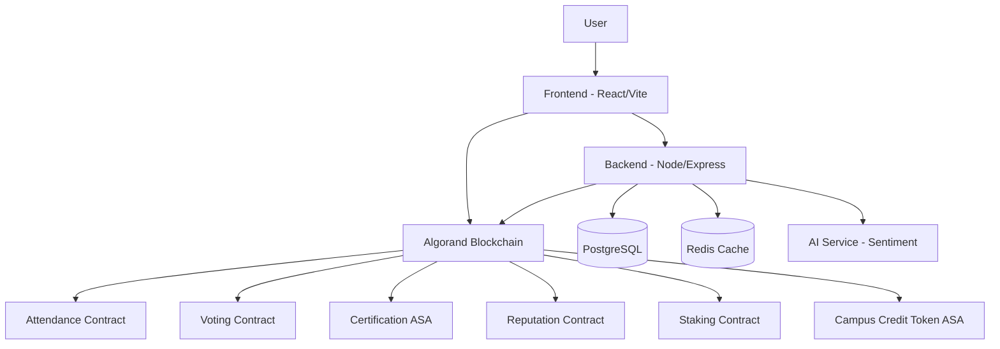

# CCMS – AI-Powered On-Chain Campus Reputation & DeFi Protocol on Algorand

> A modular Web3 campus governance protocol powered by Algorand — combining tamper-proof attendance, anonymous voting, AI-driven sentiment analysis, NFT certification, on-chain reputation scoring, and a DeFi incentive layer.

[](https://algorand.com)
[](.)
[](LICENSE)

---

## 🌟 What Makes CCMS Different

| Feature | Traditional Systems | CCMS Protocol |
|---------|-------------------|---------------|
| Attendance | Manual / QR (fakeable) | **On-chain, time-bound, cryptographic** |
| Voting | Trust-based counting | **1-wallet-1-vote, immutable, anonymous** |
| Feedback | Stored in a database | **AI sentiment + SHA256 hash anchored on-chain** |
| Certificates | PDF / paper | **ARC-standard NFTs on Algorand** |
| Reputation | Subjective / off-chain | **Weighted on-chain composite score** |
| Incentives | None | **Campus Credit Token (CCT) — earn, stake, govern** |

---

## 🏗️ Architecture



**Core Stack:**
- **Frontend**: React + Vite + TailwindCSS with Algorand wallet integration (`use-wallet-react`)
- **Backend**: Node.js / Express — off-chain orchestration, JWT auth, AI sentiment
- **Smart Contracts**: Algorand Puya Python (ABI-compliant ARC4 contracts)
- **Database**: PostgreSQL (structured data) + Redis (caching & rate limiting)
- **AI Layer**: Sentiment analysis on feedback text, scores anchored on-chain

---

## ✨ Core Features

### 🔗 Blockchain-Verified Attendance
Tamper-proof, time-bound check-ins recorded immutably on Algorand. Each attendance event generates an on-chain transaction that cannot be faked, backdated, or deleted.

### 🗳️ Anonymous On-Chain Voting
One-wallet-one-vote elections with cryptographic commitments. Vote tallies are transparent and verifiable, but individual votes remain anonymous.

### 💬 AI Sentiment Analysis (Anchored On-Chain)
Feedback text is analyzed using NLP sentiment scoring. The **SHA256 hash** of the feedback and the **scaled sentiment score** (0–100) are permanently anchored on-chain — full text is never stored on the blockchain (privacy by design).

### 🏆 NFT Certification
Automated ARC-standard NFT certificates issued upon course/event completion. Verifiable on-chain, transferable, and impossible to forge.

### ⭐ On-Chain Reputation System (NEW)
A weighted composite reputation score computed from four pillars:

| Pillar | Weight | Trigger |
|--------|--------|---------|
| Attendance | 30% | Check-in to an event |
| Voting | 25% | Cast a vote |
| Feedback | 20% | Submit feedback (weighted by sentiment) |
| Certification | 25% | Earn a certificate |

Scores are stored as **local state** on the Reputation smart contract — the blockchain is the single source of truth. PostgreSQL never stores reputation data.

### 🪙 Campus Credit Token (CCT) (NEW)
A fungible ASA (Algorand Standard Asset) used as an incentive layer:

| Action | Reward |
|--------|--------|
| Mark attendance | **1 CCT** |
| Cast a vote | **2 CCT** |
| Earn a certificate | **5 CCT** |

### ⚡ DeFi Staking & Governance (NEW)
Lightweight CCT staking contract with governance multiplier:
- **Stake CCT** to earn enhanced governance weight
- **2x vote weight** when staked balance ≥ threshold (default: 10 CCT)
- **Withdraw** anytime — no lock-up period

---

## 🚀 Quick Start

### Prerequisites

- **Node.js** (>= 18) · **Python** (3.12+) · **Docker** (for LocalNet)
- **PostgreSQL** & **Redis**
- **AlgoKit CLI** (`algokit --version` → 2.0.0+)

### 1. Clone & Bootstrap

```bash
git clone <repository-url>
cd CCMS
algokit project bootstrap all
```

### 2. Backend

```bash
cd projects/backend
cp .env.example .env
# Configure: DB credentials, DEPLOYER_MNEMONIC, HASH_SALT,
#            REPUTATION_APP_ID, CCT_ASSET_ID, STAKING_APP_ID
npm install
npm run dev
```

### 3. Smart Contracts

```bash
cd projects/contracts
algokit project run build        # Compile all contracts
algokit localnet start           # Start local Algorand node
algokit project deploy localnet  # Deploy to LocalNet
```

### 4. Frontend

```bash
cd projects/frontend
npm install
npm run dev
```

---

## 📡 API Endpoints

### Authentication
| Method | Endpoint | Description |
|--------|----------|-------------|
| POST | `/api/auth/register` | Register new user |
| POST | `/api/auth/login` | Login (returns JWT) |

### Events
| Method | Endpoint | Description |
|--------|----------|-------------|
| GET | `/api/events` | List all events |
| POST | `/api/events` | Create event (Admin) |

### Attendance
| Method | Endpoint | Description |
|--------|----------|-------------|
| POST | `/api/attendance/mark` | Mark attendance (on-chain + CCT reward) |
| GET | `/api/attendance/my` | View my attendance |
| GET | `/api/attendance/verify/:id` | Verify attendance record |

### Voting
| Method | Endpoint | Description |
|--------|----------|-------------|
| GET | `/api/voting` | List active elections |
| POST | `/api/voting/create` | Create election (Admin) |
| POST | `/api/voting/vote` | Cast anonymous vote (+ CCT reward) |

### Feedback
| Method | Endpoint | Description |
|--------|----------|-------------|
| POST | `/api/feedback/submit` | Submit anonymous feedback (AI + on-chain) |
| GET | `/api/feedback/analytics/:eventId` | Aggregated sentiment analysis |

### Certificates
| Method | Endpoint | Description |
|--------|----------|-------------|
| GET | `/api/certificates/eligibility/:eventId` | Check eligibility |
| POST | `/api/certificates/issue` | Mint NFT certificate (+ CCT reward) |
| GET | `/api/certificates/verify/:hash` | Verify certificate |

### Reputation & Rewards (NEW)
| Method | Endpoint | Description |
|--------|----------|-------------|
| GET | `/api/reputation/:walletAddress` | Get on-chain reputation score |
| GET | `/api/reputation/dashboard/:walletAddress` | Full dashboard (reputation + CCT) |

---

## 🔗 Smart Contracts

| Contract | Location | Purpose | State |
|----------|----------|---------|-------|
| **Attendance** | `smart_contracts/attendance/` | Time-bound check-ins | Global: event metadata, totals · Local: check-in status |
| **Voting** | `smart_contracts/voting/` | Anonymous elections | Global: election config · Local: has_voted, commitment |
| **Certification** | ASA (ARC standard) | NFT certificates | Asset transfer via ASA |
| **Reputation** | `smart_contracts/reputation/` | On-chain reputation | Global: weights, total_users · Local: 5 score fields |
| **Staking** | `smart_contracts/staking/` | CCT DeFi staking | Global: asset ID, threshold · Local: staked_balance |
| **CCT** | ASA (fungible) | Campus Credit Token | Standard ASA (decimals: 0) |

### Generate New Contracts
```bash
algokit generate smart-contract
```

---

## 🔐 Security Model

1. **Blockchain as Source of Truth** — Critical state (reputation, votes, certificates) lives on-chain.
2. **Privacy by Design** — Wallet addresses hashed before off-chain storage; feedback text never stored on-chain.
3. **No Admin Override** — Smart contracts enforce rules autonomously.
4. **JWT Authentication** — Secure access with token rotation and refresh.
5. **Rate Limiting** — API protected against spam (100 req / 15 min).
6. **On-Chain Sentiment Anchoring** — SHA256 hash + scaled score, not raw text.

---

## 🧪 Testing

```bash
# Backend
cd projects/backend && npm test

# Smart Contracts (AVM emulation)
cd projects/contracts && poetry run pytest
```

---

## 📦 Deployment & CI/CD

- **CI**: PRs to `main` — formatting (Black/Prettier), lint (Ruff/ESLint), types (MyPy/TS), tests
- **CD**:
  - **Contracts**: Deploy to Algorand TestNet via AlgoNode on merge
  - **Frontend**: Vercel / Netlify (configured in `.github/workflows`)

### Key Environment Variables

| Variable | Purpose |
|----------|---------|
| `JWT_SECRET` | Session signing |
| `DEPLOYER_MNEMONIC` | Contract deployment account |
| `HASH_SALT` | Anonymizing user data |
| `REPUTATION_APP_ID` | Deployed reputation contract |
| `CCT_ASSET_ID` | Campus Credit Token asset |
| `STAKING_APP_ID` | Deployed staking contract |

---

## 🛠️ Tools & Libraries

- **Algorand** — Layer 1 blockchain
- **AlgoKit** — Full-stack development suite
- **Puya (Algorand Python)** — Python smart contract DSL
- **React + Vite** — Frontend framework
- **TailwindCSS** — Utility-first styling
- **PostgreSQL** — Relational database
- **Redis** — In-memory cache
- **Sentiment.js** — NLP sentiment analysis

---

## 📄 License

MIT

## 🤝 Contributing

PRs are welcome. Please ensure all tests pass and code follows the project's architecture guidelines.
Contracts must be deployable via AlgoKit. Frontend changes should maintain the existing design system.
